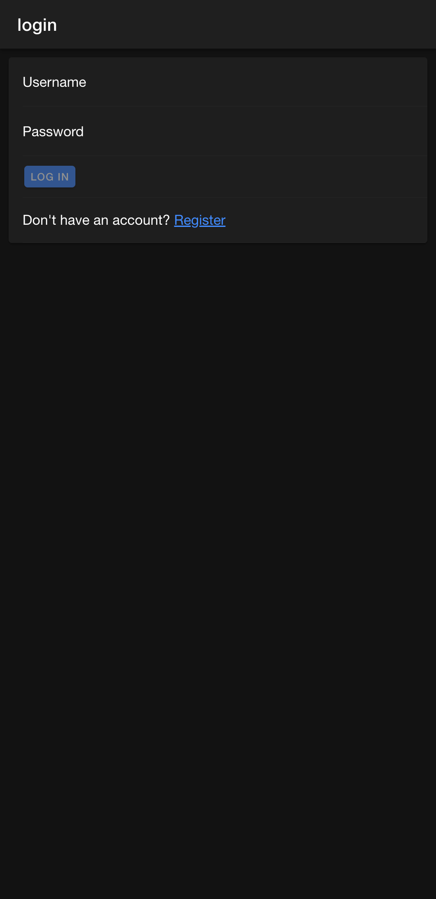
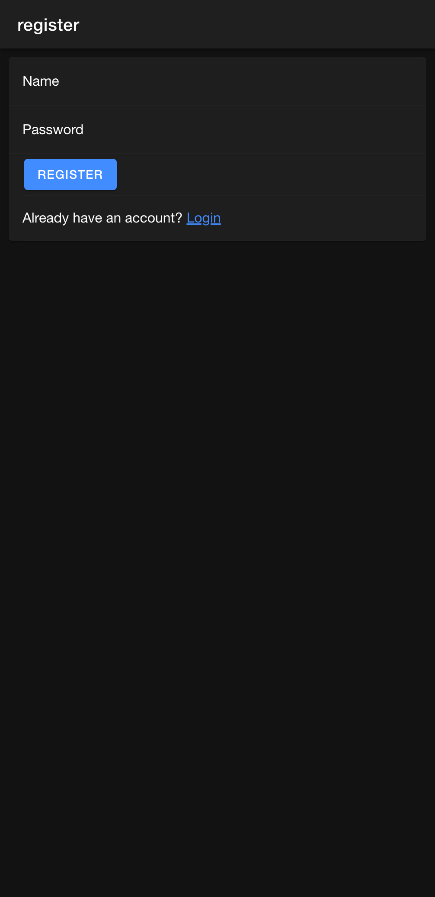
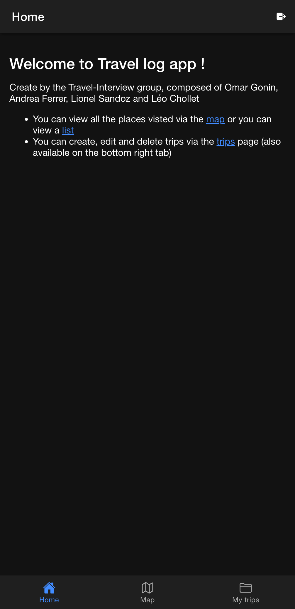
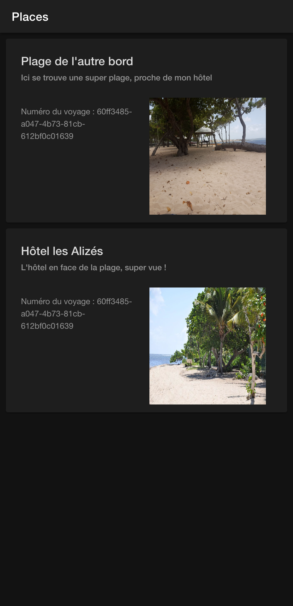
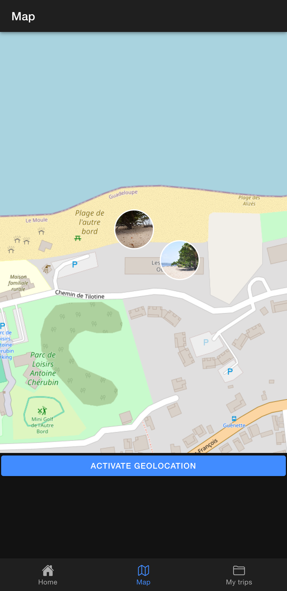
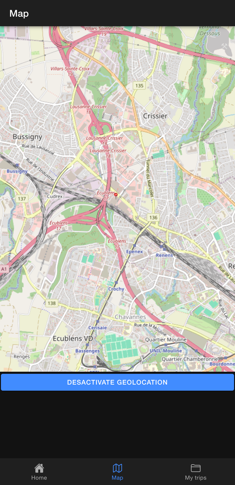
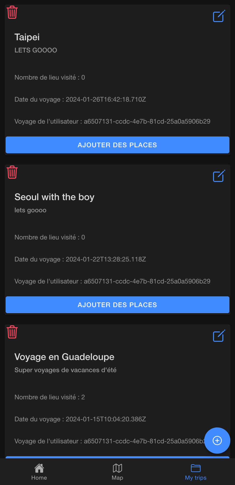
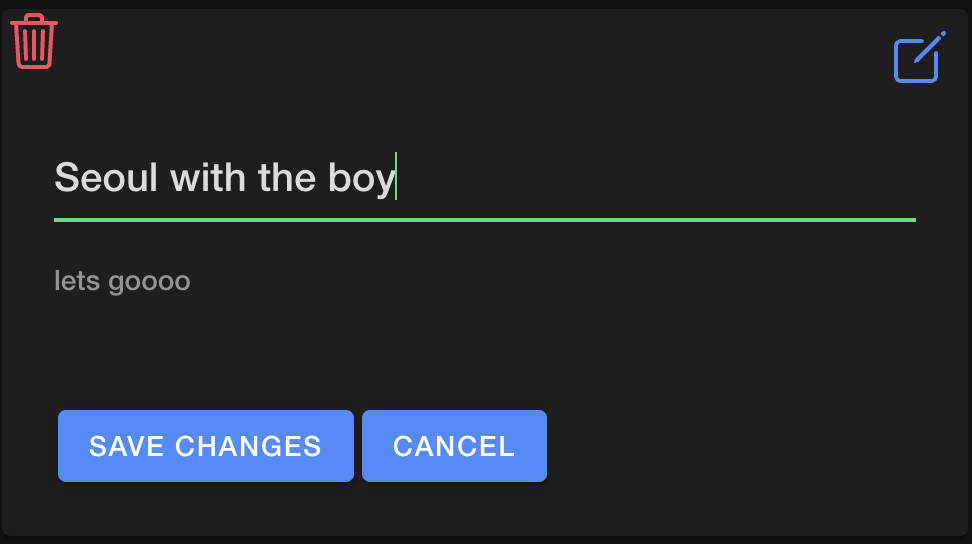
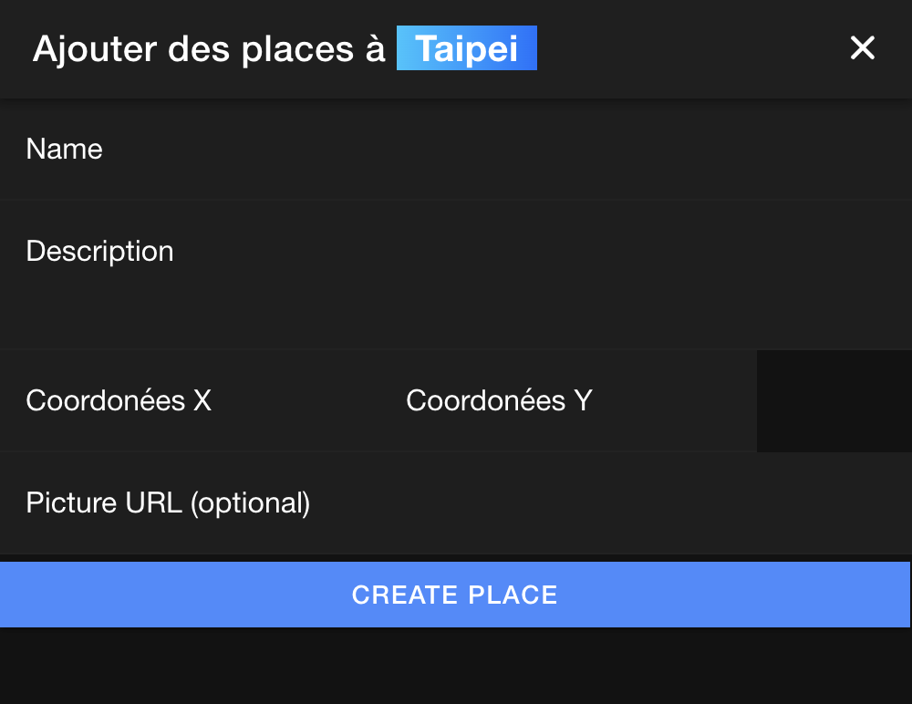

# Bienvenue sur notre application Travel Log (nom de groupe Travel-Interview)

Ce projet réalisé dans le cadre du cours DevMobil a été réalisé par Omar Gonin, Léo Chollet, Andrea Ferrer et Lionel Sandoz.

## Login/Register
La première étape de l'application consiste à créer un compte et à se connecter. Automatiquement, l'application vous propose de vous connecter (login).

{width=300px}

Si vous n'avez pas de compte, vous pouvez en créer un via la page de registration. Une fois votre compte créé, vous serez redirigé vers la page de login, qui vous conduira ensuite à la page d'accueil.

{width=300px}

## Accueil
La page d'**accueil** présente différentes fonctionnalités de l'application, telles que la visualisation des endroits visités, soit via la page map, soit via la page places (pour voir sous forme de liste les endroits).

{width=300px}

## Places/Map
La page **places** permet simplement de visualiser le titre, la description et les images des lieux visités.

{width=300px}

La page **map** permet de voir sur une carte les lieux visités avec leurs images intégrées dans de petits pins.

{width=300px}

Et il est possible aussi d'activer la géolocalisation et de pouvoir voir sur la carte sa position actuelle.

{width=300px}

## My trips
La page **my trips** permet de visualiser les voyages entrepris.

{width=300px}

De les modifiers via un interface simple.

{width=300px}

De les supprimers.

{width=300px}

Et d'ajouter des endroits visités lors de voyages.

{width=300px}
